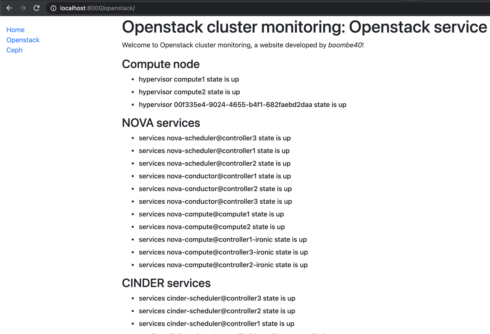

# openstack-cluster-monitoring
This project create for monitoring cluster after deploy.

## ENV requirement
```
OS_USERNAME=""
OS_PASSWORD=""
OS_AUTH_URL=""
OS_AUTH_PLUGIN=""
OS_PROJECT_NAME=""
OS_PROJECT_DOMAIN_NAME=""
OS_USER_DOMAIN_NAME=""
OS_INTERFACE=""
OS_ENDPOINT_TYPE=""

```

# manual start webserver
```
virtualenv -p python3 env
source ./env/bin/activate
pip install -r ./requirements.txt

cd ./openstackclustermonitoring
python manage.py runserver

```


preview
